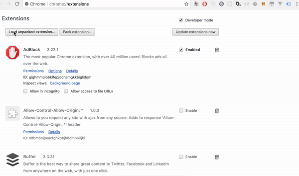

# Bitome

A Chrome Extension cryptocurrency tracker converter  (via coinmarketcap api)

## Getting Started

This is open source project to chrome extension.

### Dev Prerequisites

NPM 8 (8.9.3)

```
#run install
npm install

#run dev
npm run dev

#chrome://extensions load unpacked to project path
```

### pure Installing

1. Download [Bitome](https://github.com/kelvin2go/bitome/blob/master/demo/build.zip)
2. go to extensions (chrome://extensions)
3. developer mode (if not ready)
4. load the upziped build.zip
5. enjoy! 🍻

## DEMO picture





## Built With

* [wcer](https://github.com/YuraDev/vue-chrome-extension-template) - the vue template chrome extension
* [Vue.js](https://vuejs.org/) - Vuejs


if any issue, leave issue / comment :) 
