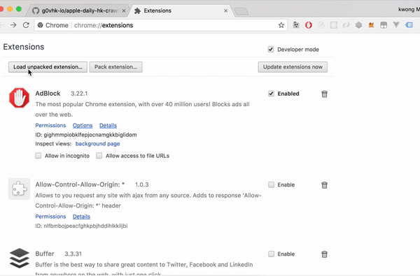
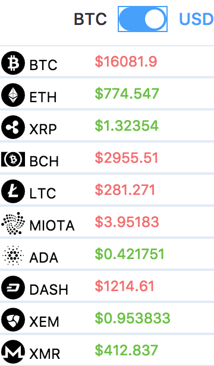
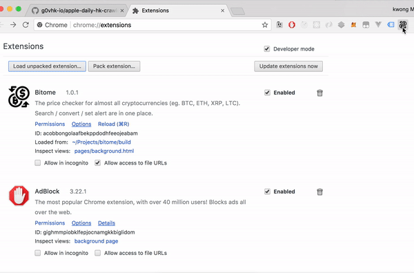
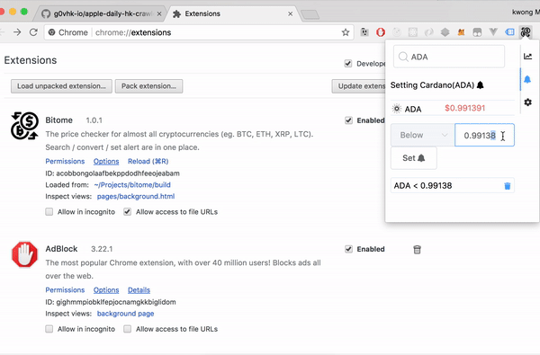

# Bitome

 A Chrome Extension cryptocurrency tracker converter (via coinmarketcap api). Check out the latest price on (top 10) Cryptocurrency as Bitcoin (BTC), Ethereum (ETH), Ripple (XRP), bitcoin cash (BCH), Lite coin(LTC)

### Direct Install

1. Download [Bitome](https://github.com/kelvin2go/bitome/raw/master/demo/build.zip)
2. go to extensions (chrome://extensions)
3. developer mode (if not ready)
4. load the upziped build.zip
5. enjoy! 🍻



## DEMO picture on chrome extension
#### ScreenShot


#### Feature


#### Notification



### Dev Prerequisites
* NPM 8 (8.9.3)

### Dev development
```
#run install
npm install

#run dev
npm run dev

#chrome://extensions load unpacked to project path
```

### TO DO LIST
* [trello](https://trello.com/b/DB49Ktsa/bitome-%F0%9F%A5%87)

## Built With

* [wcer](https://github.com/YuraDev/vue-chrome-extension-template) - the vue template chrome extension
* [Vue.js](https://vuejs.org/) - Vuejs
* [coinmarketcap api](https://coinmarketcap.com/api/)

## Forum / chat
[Discord](https://discord.gg/D59AWtk)
* [TitanEmbeds](https://titanembeds.com/embed/399447374294024202)

## Feedback
If any issue / new feature, leave issue / comment :)
